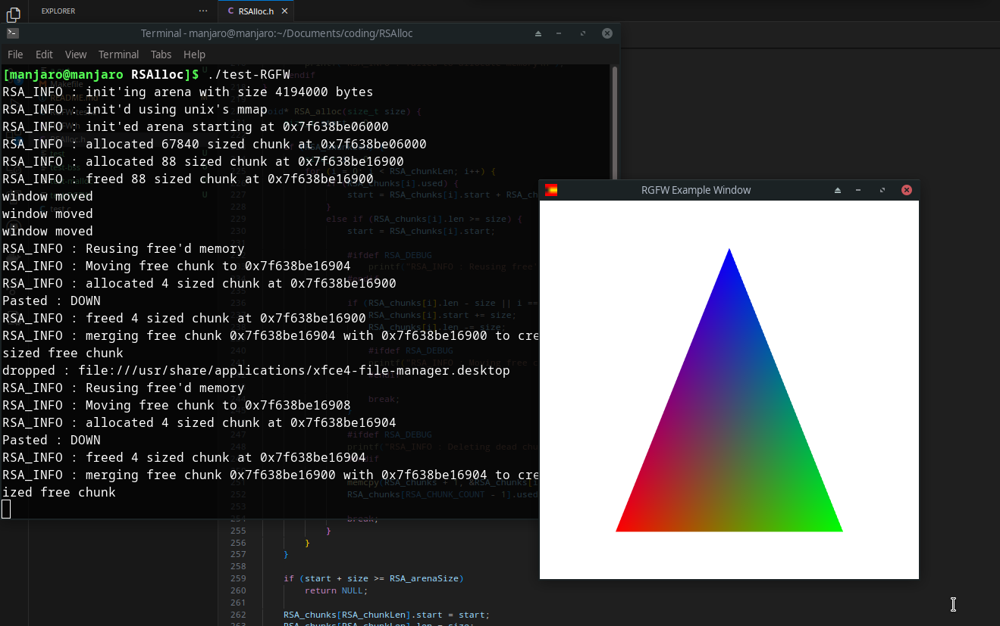

# RSAlloc
Single-header custom allocator for fun supports, malloc, mmap (unix), virtualAlloc (windows) and bss memory

# building
to build the examples use\
    `make`\
or\
    `make debug`\
to build and run the examples

# examples
`test.c` -> compiles to a mmap or virtualAlloc example and a bss and malloc example\
`RGFW-test.c` -> RSAlloc example for RGFW